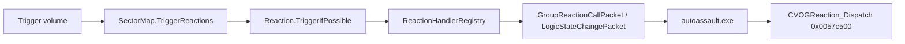

# Reaction types

Map **reactions** are logic nodes referenced by trigger volumes (and chained from other reactions). Each reaction has a type byte (0–87) matching [`ReactionType`](../src/AutoCore.Game/Entities/Reaction.cs) and a binary layout in [`ReactionTemplate`](../src/AutoCore.Game/EntityTemplates/ReactionTemplate.cs).

This document is the human-readable companion to the machine-readable catalog at [`tools/model-viewer/reaction-catalog.json`](../tools/model-viewer/reaction-catalog.json). The level viewer, MapDump exporter, and server scaffold all consume that JSON.

## Execution flow



Retail embeds authoritative reaction handling in the client binary (`autoassault.exe`). AutoCore runs handlers on the sector server first, then notifies clients so the retail dispatch path can run UI-only effects.

**Realm** values in the catalog:

| Realm | Meaning |
|-------|---------|
| `server` | Authoritative state change on sector server (object lifecycle, variables, missions). |
| `client` | Presentation / UI only on the game client after the packet arrives. |
| `server-then-client` | Server mutates state, client shows feedback (rare; see per-type notes in JSON). |

## Ghidra anchors (AA-decode)

| Symbol | Address | Role |
|--------|---------|------|
| `CVOGReaction_Dispatch` | `0x0057c500` | Switch on reaction type 0–87 (`VOGReaction.cpp`) |
| Variable lookup | `0x005b05f0` | Read map variable by id |
| Variable set | `0x005afbc0` | Write map variable |
| Nested reaction fire | `0x004cd3a0` | Chain `Reactions[]` COIDs |

Regenerate the catalog after Ghidra updates: `node tools/scripts/build-reaction-catalog.mjs`.

## Worked examples

### Activate / Delete / Death (object lifecycle)

| Type | ID | Key fields | Behavior |
|------|----|------------|----------|
| Activate | 0 | `Objects[]` | Resolve each TFID; call activate vfunc; chain nested reactions. |
| Delete | 3 | `Objects[]` | Despawn via `FUN_004db8b0` (no loot). |
| Death | 8 | `Objects[]` | Death flag path on same helper; may grant loot. |

AutoCore Tier A handlers: `SetLogicActive`, `LeaveMap`, `MarkDead` + `LeaveMap`.

### Text (dialog)

| Field | Role |
|-------|------|
| `Text.Main` | Dialog body |
| `Text.Choices[].TriggerCoid` | **Trigger COID** (not a nested reaction) |
| `Text.TargetType` | `Client` vs `Convoy` audience |

MapDump exports `LinkedTriggerCoids` separately from `NestedReactionCoids`. The viewer drill-down links choice buttons to triggers.

Full map walkthrough with every trigger and mission gate: [Ark Bay tutorial (arkgetaway)](arkgetaway.md).

### MarkRepairStation

| Field | Role |
|-------|------|
| `GenericVar1` | Repair station index bookmarked for INC airlift |

Handler: `FUN_00521e00`. AutoCore stores per-character station id on `SectorMap`.

### CompleteObjective / FailMission

| Field | Role |
|-------|------|
| `GenericVar1` | Mission id |
| `ObjectiveIDCheck` | Objective gate / index check |

Handlers: `FUN_00533f90` (complete), `FUN_0052da30` (fail, packet `0x20B2`). Server handlers currently log; full mission port pending.

### VariableSetRandom

| Field | Role |
|-------|------|
| `GenericVar1` | Target variable id |
| `GenericVar2` | Range minimum |
| `GenericVar3` | Range maximum |

Uses RNG table then `FUN_005afbc0`. AutoCore: `MapVariableRuntime.SetRandom`.

### TransferMap

| Field | Role |
|-------|------|
| `MapTransfer` | Transfer kind byte |
| `MapTransferData` | Payload id (continent / spawn) |

No `Objects[]` in file layout for this type. AutoCore handler is scaffolded (warp port pending).

### Unsupported in retail dispatch

`MakeFriend`, `MakeEnemy`, and `ClientText` appear in the enum and map files but fall through to the unknown-type path in `CVOGReaction_Dispatch`.

## Full type reference

| ID | Name | Realm | Field semantics | Side effects | Ghidra handler | AutoCore status |
|----|------|-------|-----------------|--------------|----------------|-----------------|
| 0 | Activate | server | Objects: Objects to activate | objectState | inline@CVOGReaction_Dispatch | tier-a |
| 1 | Deactivate | server | Objects: Objects to deactivate | objectState | inline@CVOGReaction_Dispatch | tier-a |
| 2 | Create | server | Objects: Object templates to spawn | objectSpawn | inline@CVOGReaction_Dispatch | tier-a |
| 3 | Delete | server | Objects: Objects to delete | objectDespawn | inline@CVOGReaction_Dispatch | tier-a |
| 4 | MakeFriend | server | Objects: Target objects | — | inline@CVOGReaction_Dispatch | unsupported-retail |
| 5 | MakeEnemy | server | Objects: Target objects | — | inline@CVOGReaction_Dispatch | unsupported-retail |
| 6 | MakeInvincible | server | Objects: Objects | combatState | inline@CVOGReaction_Dispatch | documented |
| 7 | MakeNotInvincbile | server | Objects: Objects | combatState | inline@CVOGReaction_Dispatch | documented |
| 8 | Death | server | Objects: Objects to kill | objectDeath, loot | inline@CVOGReaction_Dispatch | tier-a |
| 9 | TakeArena | server | GenericVar1: Arena id | arena | inline@CVOGReaction_Dispatch | documented |
| 10 | TransferMap | server | MapTransfer: Transfer type; MapTransferData: Transfer payload id | mapTransfer | inline@CVOGReaction_Dispatch | tier-a |
| 11 | ClientText | client | — | clientUi | inline@CVOGReaction_Dispatch | unsupported-retail |
| 12 | SkillCast | server | GenericVar1: Skill id; GenericVar3: Skill level / rank; Objects: Optional explicit targets | combat | inline@CVOGReaction_Dispatch | documented |
| 13 | VariableSet | server | GenericVar1: Destination variable id; GenericVar2: Source variable id (float operand); GenericVar3: Constant value when non-zero | mapVariable | inline@CVOGReaction_Dispatch | tier-a |
| 14 | VariableAdd | server | GenericVar1: Variable id; GenericVar3: Addend variable id | mapVariable | inline@CVOGReaction_Dispatch | tier-a |
| 15 | VariableSub | server | GenericVar1: Variable id; GenericVar3: Subtrahend variable id | mapVariable | inline@CVOGReaction_Dispatch | tier-a |
| 16 | Enable | server | Objects: Objects | objectState | inline@CVOGReaction_Dispatch | tier-a |
| 17 | Disable | server | Objects: Objects | objectState | inline@CVOGReaction_Dispatch | tier-a |
| 18 | Text | client | Text: Dialog payload (Type, TargetType, Main, Choices); Objects: Optional target list for text params | clientUi, dialog | inline@CVOGReaction_Dispatch | documented |
| 19 | ResetTrigger | server | GenericVar1: Trigger COID to reset | triggerState | inline@CVOGReaction_Dispatch | tier-a |
| 20 | SetFaction | server | GenericVar1: Faction id; Objects: Character targets | faction | inline@CVOGReaction_Dispatch | documented |
| 21 | ResetFaction | server | Objects: Character targets | faction | inline@CVOGReaction_Dispatch | documented |
| 22 | SetFactionFromVar | server | GenericVar1: Variable holding faction id; Objects: Character targets | faction, mapVariable | inline@CVOGReaction_Dispatch | documented |
| 23 | SetHP | server | GenericVar1: Variable holding HP percent (0-100); Objects: Damageable targets | combatState | inline@CVOGReaction_Dispatch | documented |
| 24 | Boost | server | GenericVar1: Magnitude variable id; GenericVar3: -1 = additive to facing vector; Objects: Physics objects | physics | inline@CVOGReaction_Dispatch | documented |
| 25 | RemoveFromInv | server | GenericVar1: Item CBID or slot rule; Objects: Players | inventory | inline@CVOGReaction_Dispatch | documented |
| 26 | AdjustCredits | server | GenericVar1: Variable holding credit delta | economy | inline@CVOGReaction_Dispatch | documented |
| 27 | AddSkillPoints | server | GenericVar1: Points variable id | progression | inline@CVOGReaction_Dispatch | documented |
| 28 | AddXP | server | GenericVar1: XP amount variable id | progression | inline@CVOGReaction_Dispatch | documented |
| 29 | MarkRepairStation | server | GenericVar1: Repair station id (map object index) | playerState, respawn | inline@CVOGReaction_Dispatch | tier-a |
| 30 | GiveMission | server | GenericVar1: Mission id | mission | inline@CVOGReaction_Dispatch | tier-a |
| 31 | CompleteObjective | server | GenericVar1: Mission id; ObjectiveIDCheck: Required objective index (condition) | mission, progression, clientUi | inline@CVOGReaction_Dispatch | tier-a |
| 32 | UnlockContObj | server | GenericVar1: Continent object id | worldUnlock | inline@CVOGReaction_Dispatch | documented |
| 33 | AddMissionString | server | GenericVar1: String id; GenericVar3: Mission id | mission | inline@CVOGReaction_Dispatch | documented |
| 34 | DelMissionString | server | GenericVar1: String id; GenericVar3: Mission id | mission | inline@CVOGReaction_Dispatch | documented |
| 35 | AddWaypoint | client | GenericVar1: Waypoint id; WaypointType: Kill / Protect / Interact; WaypointText: Waypoint label text | missionUi | inline@CVOGReaction_Dispatch | documented |
| 36 | DelWaypoint | client | GenericVar1: Waypoint id | missionUi | inline@CVOGReaction_Dispatch | documented |
| 37 | GiveMissionDialog | client | Missions: Allowed mission ids; MissionTypes: Allowed mission type ids | clientUi, mission | inline@CVOGReaction_Dispatch | documented |
| 38 | GiveItemNumCBID | server | GenericVar1: Clonebase item CBID; GenericVar3: Stack count | inventory | inline@CVOGReaction_Dispatch | documented |
| 39 | GiveItemNumCBIDGen | server | GenericVar1: Clonebase item CBID; GenericVar3: Stack count | inventory | inline@CVOGReaction_Dispatch | documented |
| 40 | OpenBodyShop | client | — | clientUi | inline@CVOGReaction_Dispatch | documented |
| 41 | OpenRefinery | client | — | clientUi | inline@CVOGReaction_Dispatch | documented |
| 42 | OpenGarage | client | — | clientUi | inline@CVOGReaction_Dispatch | documented |
| 43 | SetPath | server | GenericVar1: Map path id; Objects: Creatures | ai | inline@CVOGReaction_Dispatch | documented |
| 44 | SetPatrolDistance | server | GenericVar1: Distance variable id; Objects: Creatures / vehicles | ai, mapVariable | inline@CVOGReaction_Dispatch | documented |
| 45 | Teleport | server | GenericVar2: Random scatter radius; Objects: Objects to teleport | position | inline@CVOGReaction_Dispatch | documented |
| 46 | TimerStart | server | GenericVar3: Timer id; MiscText: Timer name string | timer | inline@CVOGReaction_Dispatch | documented |
| 47 | TimerStop | server | GenericVar3: Timer id; MiscText: Timer name string | timer | inline@CVOGReaction_Dispatch | documented |
| 48 | VariableSetRandom | server | GenericVar1: Destination variable id; GenericVar2: Random range multiplier; GenericVar3: Minimum offset (timer id field reused as min in maps) | mapVariable | inline@CVOGReaction_Dispatch | tier-a |
| 49 | VariableMul | server | GenericVar1: Destination variable id; GenericVar3: Multiplier variable id | mapVariable | inline@CVOGReaction_Dispatch | tier-a |
| 50 | VariableDiv | server | GenericVar1: Destination variable id; GenericVar3: Divisor variable id | mapVariable | inline@CVOGReaction_Dispatch | tier-a |
| 51 | GiveMedal | server | GenericVar1: Medal id | progression | inline@CVOGReaction_Dispatch | documented |
| 52 | OpenStore | client | GenericVar1: Store id | clientUi | inline@CVOGReaction_Dispatch | documented |
| 53 | SetTeamFaction | server | GenericVar1: Team faction id; Objects: Characters | faction | inline@CVOGReaction_Dispatch | documented |
| 54 | ResetTeamFaction | server | Objects: Characters | faction | inline@CVOGReaction_Dispatch | documented |
| 55 | SetTeamFactionFromVar | server | GenericVar1: Faction variable id; Objects: Characters | faction, mapVariable | inline@CVOGReaction_Dispatch | documented |
| 56 | AddPoints | server | GenericVar1: Points delta; GenericVar3: Non-zero: subtract mode | arena | inline@CVOGReaction_Dispatch | documented |
| 57 | ResetPoints | server | GenericVar1: Arena slot (-1 = all) | arena | inline@CVOGReaction_Dispatch | documented |
| 58 | OpenArena | client | — | clientUi | inline@CVOGReaction_Dispatch | documented |
| 59 | OpenClanManager | client | — | clientUi | inline@CVOGReaction_Dispatch | documented |
| 60 | SetActiveObjective | client | GenericVar1: Mission id; GenericVar3: Objective index | missionUi | inline@CVOGReaction_Dispatch | documented |
| 61 | ProgressBar | client | — | clientUi | inline@CVOGReaction_Dispatch | documented |
| 62 | SetMapWaypoint | client | GenericVar1: Waypoint id; GenericVar3: Map icon id; Objects: Position source objects | mapUi | inline@CVOGReaction_Dispatch | documented |
| 63 | SetMapDynamicWaypoint | client | GenericVar1: Waypoint id; GenericVar3: Map icon id; Objects: Tracked objects | mapUi | inline@CVOGReaction_Dispatch | documented |
| 64 | SetStatusText | client | GenericVar1: Status slot id; WaypointText: Status text | missionUi | inline@CVOGReaction_Dispatch | documented |
| 65 | SetProgressBar | client | GenericVar1: Progress bar id; GenericVar3: Maximum value; WaypointText: Bar label | missionUi | inline@CVOGReaction_Dispatch | documented |
| 66 | RemoveProgressBar | client | GenericVar1: Progress bar id | missionUi | inline@CVOGReaction_Dispatch | documented |
| 67 | RemoveText | client | GenericVar1: Status slot id | missionUi | inline@CVOGReaction_Dispatch | documented |
| 68 | RemoveMapWaypoint | client | GenericVar1: Waypoint id | mapUi | inline@CVOGReaction_Dispatch | documented |
| 69 | RemoveMapDynamicWaypoint | client | GenericVar1: Waypoint id | mapUi | inline@CVOGReaction_Dispatch | documented |
| 70 | RelockContObj | server | GenericVar1: Continent object id | worldUnlock | inline@CVOGReaction_Dispatch | documented |
| 71 | OpenSkillTrainer | client | GenericVar1: Trainer id; GenericVar3: Skill tree id | clientUi | inline@CVOGReaction_Dispatch | documented |
| 72 | FailMission | server | GenericVar1: Mission id; ObjectiveIDCheck: Objective gate for CanTrigger | mission | inline@CVOGReaction_Dispatch | tier-a |
| 73 | SpawnCollide | server | Objects: Spawn anchors | objectSpawn, physics | inline@CVOGReaction_Dispatch | documented |
| 74 | FirstTimeEvent | server | GenericVar1: First-time event id | playerState | inline@CVOGReaction_Dispatch | documented |
| 75 | OpenDialog | client | Text: Dialog payload | clientUi, dialog | inline@CVOGReaction_Dispatch | documented |
| 76 | PlayMusic | client | MiscText: Music track name | audio | inline@CVOGReaction_Dispatch | documented |
| 77 | Path | server | MiscText: Path name; Objects: Creatures | ai | inline@CVOGReaction_Dispatch | documented |
| 78 | CaptureOutpost | server | GenericVar1: Outpost id; Objects: Outpost objects | pvp, worldState | inline@CVOGReaction_Dispatch | documented |
| 79 | SetLevel | server | GenericVar1: Level variable id; Objects: Characters | progression | inline@CVOGReaction_Dispatch | documented |
| 80 | GiveRespec | client | — | clientUi | inline@CVOGReaction_Dispatch | documented |
| 81 | RollFromLootTable | client | — | clientUi, loot | inline@CVOGReaction_Dispatch | documented |
| 82 | TimerPause | server | GenericVar3: Timer id; MiscText: Timer name | timer | inline@CVOGReaction_Dispatch | documented |
| 83 | TaxiStops | client | MiscText: Taxi UI text | clientUi | inline@CVOGReaction_Dispatch | documented |
| 84 | RaceWaypointReached | client | — | missionUi, race | inline@CVOGReaction_Dispatch | documented |
| 85 | StartRaceTimer | client | GenericVar1: Race id; GenericVar3: Timer duration | clientUi, race | inline@CVOGReaction_Dispatch | documented |
| 86 | OpenMailBox | client | — | clientUi | inline@CVOGReaction_Dispatch | documented |
| 87 | OpenAuctionHouse | client | — | clientUi | inline@CVOGReaction_Dispatch | documented |

## Ghidra function registry

Reaction handlers call into shared helpers (object resolve, map variables, mission APIs, client UI packets). For the two example maps (`sec_f_h_map_tut_j2_arkbaytutorial`, `sec_f_b_map_hwy_a2_1_scrapvalley`), **28 unique callee addresses** are documented in [`tools/model-viewer/ghidra-functions.json`](../tools/model-viewer/ghidra-functions.json).

Each entry records:

| Field | Meaning |
|-------|---------|
| `symbol` | Renamed Ghidra symbol (e.g. `CVOGReaction_MarkRepairStation`) |
| `legacyName` | Original decompiler label (`FUN_00521e00`) |
| `decompiledSignature` | C-like prototype from Ghidra decompilation |
| `reactionTypes` | Reaction types from the example maps that call this helper |

Workflow:

```bash
node tools/scripts/extract-reaction-ghidra-worklist.mjs
# Ghidra AA-decode: decompile + rename (see tools/scripts/ghidra-function-manifest.json)
node tools/scripts/sync-ghidra-functions.mjs
```

The level viewer reaction inspector shows **symbol · decompiled signature @ address** for each callee via `ghidra-functions.js`.

## MapDump and viewer

- MapDump loads the catalog at export time (`ReactionCatalog.cs`) and bakes `Semantics` (including `Callees[]` from `ghidra-functions.json`) into precomputed trigger graphs.
- Re-run MapDump after catalog changes so `tools/model-viewer/levels/*.json` includes semantics:

```
tools/AutoCore.MapDump/bin/Release/net8.0/mapdump.exe <game-dir> assets/extracted/maps tools/model-viewer/levels
```

- Level viewer: reaction inspector drill-down shows **Ghidra callees** (renamed symbol + decompiled signature + address), realm badges, and **View → Reaction types** reference panel. Data sources: `reaction-catalog.js` + `ghidra-functions.js`.

## Server implementation

[`ReactionHandlerRegistry`](../src/AutoCore.Game/Reactions/ReactionHandlerRegistry.cs) registers Tier A handlers. `Reaction.TriggerIfPossible` delegates there. Status `tier-a` in the catalog means a handler exists (some mission/warp paths still log-only).

Map variable conditionals on triggers use `MapVariableRuntime` + `TriggerConditional.Check`.

## Tests

```bash
node tools/scripts/extract-reaction-ghidra-worklist.mjs
node --test tools/model-viewer/ghidra-functions.test.js tools/model-viewer/reaction-catalog.test.js tools/model-viewer/reaction-execution.test.js tools/model-viewer/trigger-graph.test.js
dotnet test tools/AutoCore.MapDump.Tests/
dotnet test src/AutoCore.Game.Tests/
```

## See also

- [Level renderer](level-renderer.md) — trigger inspector UX
- [`ReactionTemplate`](../src/AutoCore.Game/EntityTemplates/ReactionTemplate.cs) — binary layout
- [`ReactionType`](../src/AutoCore.Game/Entities/Reaction.cs) — C# enum
